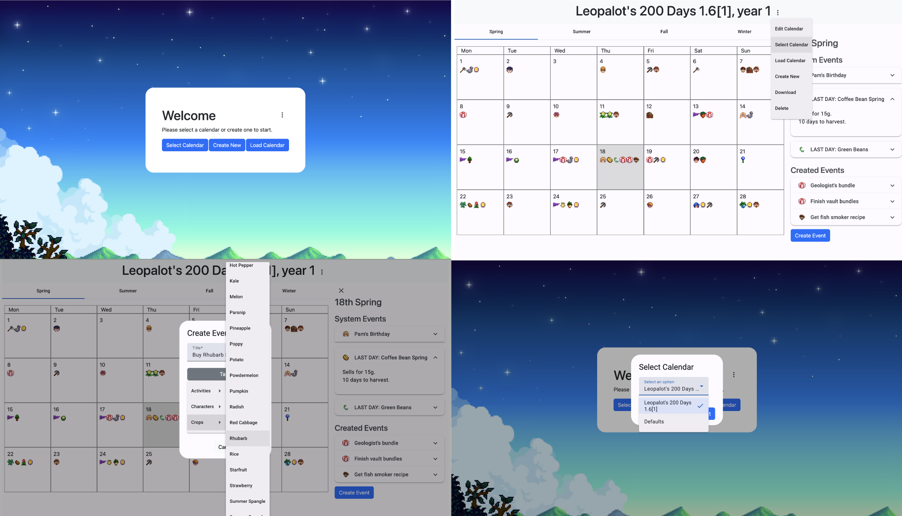

# Stardew Valley Calendar Planner

Docker setup is still in progress. In the meantime, after doing an `npm i` in both the `calendar-app` and `calendar-db` directories, to set up, you may make use of the VSCode tasks.

### Setting Up Locally

### 1. Press Commands to Show All Commands

Mac users use `command + shift + p`
Windows users use `control + shift p`
You should get the following popup:

### 2. Select `Tasks: Run Task`

You should see these options:

### 3. Select `Start App`

Your terminal should then run 2 tasks `app` and `db`:

Note that if this is your first time starting the app, you will need to set up your local Strapi account here.

And voila! If you have not already, you will be prompted to create a Strapi account locally, but after that is done, your calendar app should connect to your local Strapi server for use!

## Setting Up Strapi Locally

If you are setting up Strapi for the first time, when you open [`localhost:1337/admin](http://localhost:1337/admin), it will prompt you to sign up. Do not worry, this sign up is free and just saves your login details locally.

Once you have signed in, you will need to create an API token, of which you will have to pass to the application.

### Generating Token

#### 1. Go to Settings and Click `Create new API Token`

#### 2. Give Token Full Access and Click `Save`

A token should be generated for you to copy. Save this.

### Setting Up the App with a Token

After you have set up your Strapi account and token and still have the Strapi server running locally, there are 2 options to getting ready with the app.

#### 1. Opening the App Locally

To save time if opening the app locally, you may paste the token into the constant file `./calendar-app/src/app/constants/keys.constant.ts`. This will pass the token into the data service by default so that you do not need to input it again.

#### 2. Opening the App via Live GitHub Pages Page

If you are accessing the app via the live page (`https://anlanther.github.io/stardew-valley-calendar/`), you will need to add the token via the token dialog:

If the token works, you will be able to see this version of the welcome page:

